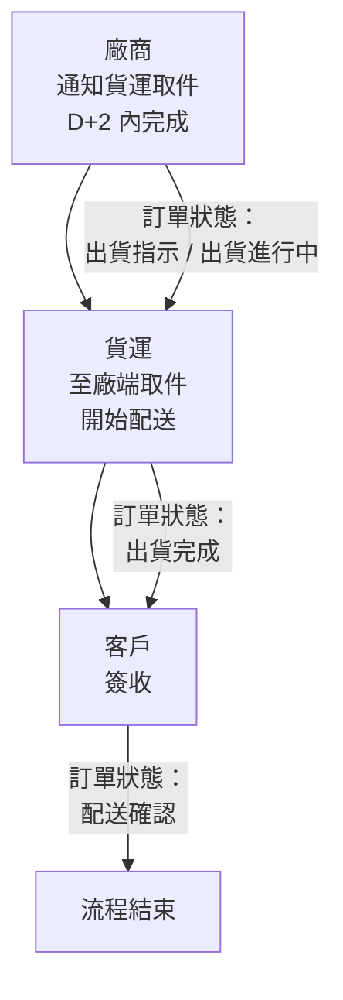

Page: 17/127

# 【商品配送方式】

1. 分『庫送、廠送』兩大類，其送貨/收貨方式與配送範圍不同，接單時務必詳閱。
2. 客戶不可指定貨運公司。
   ※ 系統配送訊息貨運欄位呈現為『新竹貨運-快』，故線上若看到系統貨運註明為「新竹貨運-快」，即指
   新竹貨運委外之「超峰快遞」所配送。

## 庫送

| 配送類型 | 一般商品                     | 快速到貨                       |
| -------- | ---------------------------- | ------------------------------ |
| 送貨方式 | 新竹貨運、新一速達           | 新竹貨運、新一速達             |
| 配送範圍 | 不限含離島（系統會自訂判斷） | 限部分面交區（系統會自訂判斷） |
| 付款方式 | 皆可                         | 不可 ATM、POST 等行動支付      |

## 廠送

| 配送類型 | 一般配送                           | 到貨取貨     |
| -------- | ---------------------------------- | ------------ |
| 送貨方式 | 廠商自行派送（通用／快捷／自營等） | 東森活動贈品 |
| 配送範圍 | 依系統設定                         | 不送離島     |
| 付款方式 | 不可 COD                           | 皆可         |

## 特約

| 配送類型 | 特約                         |
| -------- | ---------------------------- |
| 送貨方式 | 新竹貨運、新一速達           |
| 配送範圍 | 不限含離島（系統會自訂判斷） |
| 付款方式 | 不可 COD                     |

## 超商取貨

| 配送類型 | 一般商品（常溫）5000 元(含)以下 | 一般商品（常溫）5000 元以上 | 低溫冷凍不限金額 |
| -------- | ------------------------------- | --------------------------- | ---------------- |
| 送貨方式 | 全家、7-11                      | 全家、7-11                  | 全家、7-11       |
| 配送範圍 | 依系統設定                      | 依系統設定                  | 依系統設定       |
| 付款方式 | 除 POST 以外皆可                | 僅可 COD、COD + 信用卡      | 僅能信用卡或 ATM |

## 到廠取貨流程

a. 送貨方式

訂單狀態的出貨完成代表在路途中，配送確認才代表送達客戶

b. 退貨方式
由供應商指派貨運收件 (比照廠送方式)