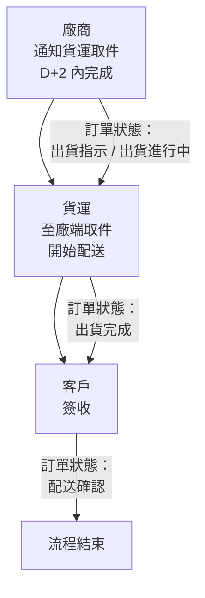

Page: 1/127
錢進系統 MONEY IN 操作手冊<專員版>
編制單位：人才培育處
113.11.20
一、系統登入：
1、啟動桌面【錢進系統 MI 正式區】的捷徑(如下圖)
2、請於首頁登入帳號密碼(同開機帳密)及分機(席位號碼)提醒：分機號碼僅需登打數字就好，不須
加 P
3、foot 新增版號、host 機器-因有些專員會卡在沒更新的系統，故在 foot 跟登入頁新增資訊來辨
識版本

---

Page: 2/127
主要功能提醒

-   點擊 MoneyIN Logo 左側的按鈕可以重新整理功能列表

-   上方功能選單:

| 功能名稱 | 說明                                             |
| -------- | ------------------------------------------------ |
| 軟體電話 | 點擊後會提供軟體電話的介面，可用於撥打、接聽電話 |
| 即時訊息 | 網站訊息通知、預約訊息                           |
| 通知中心 | 網站各個功能的小鈴鐺通知                         |
| 記事本   | 提供記事本功能                                   |

-   左側大功能選單:

| Group Name   | Function Name    | Description                                                                                                                                                                                                                                              |
| ------------ | ---------------- | -------------------------------------------------------------------------------------------------------------------------------------------------------------------------------------------------------------------------------------------------------- |
| 權限管理     | 系統功能         |                                                                                                                                                                                                                                                          |
| 權限管理     | 系統角色         |                                                                                                                                                                                                                                                          |
| 權限管理     | 使用者列表       |                                                                                                                                                                                                                                                          |
| 訂單客服管理 | 明細             |                                                                                                                                                                                                                                                          |
| 訂單客服管理 | TM 名單推薦      |                                                                                                                                                                                                                                                          |
| 訂單客服管理 | 客戶查詢         | 客戶查詢是用來快速查找並檢視客戶資料的功能模組， 可依據客戶編號、電話、身分證字號、姓名或電子信箱等條件進行查詢， 查詢結果會顯示基本資料如手機、地址、信箱、會員等級與維運專員等， 右側提供功能按鈕可執行訂單查詢、聯繫歷史、活動管理、票券操作 |
| 訂單客服管理 | 限量品登記       |                                                                                                                                                                                                                                                          |
| 訂單客服管理 | 接單作業         |                                                                                                                                                                                                                                                          |
| 訂單客服管理 | 訂單管理         | 訂單管理                                                                                                                                                                                                                                                 |
| 訂單客服管理 | 銷退管理         |                                                                                                                                                                                                                                                          |
| 訂單客服管理 | 客訴處理         | OB 和 IB 使用功能，可查詢客戶客訴問題，OB 專員可協助客戶建立客訴，處理 OB 相關客訴                                                                                                                                                                       |
| 訂單客服管理 | 會員明細         |                                                                                                                                                                                                                                                          |
| 訂單客服管理 | 帳戶明細         | 帳戶明細                                                                                                                                                                                                                                                 |
| 訂單客服管理 | 聯繫歷史         |                                                                                                                                                                                                                                                          |
| 訂單客服管理 | 電話小結作業     | 電話小結作業                                                                                                                                                                                                                                             |
| 訂單客服管理 | 客服員待辦事項   | 客服員待辦事項                                                                                                                                                                                                                                           |
| 訂單客服管理 | 問卷管理         |                                                                                                                                                                                                                                                          |
| 訂單客服管理 | 活動管理         | 行銷活動、優惠方案的內容與報名名單管理                                                                                                                                                                                                                   |
| 訂單客服管理 | 票劵/預約        | 自然美電子票劵                                                                                                                                                                                                                                           |
| 訂單客服管理 | 直播/見面會報名  | 直播活動場次報名                                                                                                                                                                                                                                         |
| 訊息管理     | 訊息查詢         | 歷史訊息查詢                                                                                                                                                                                                                                             |
| 訊息管理     | 通知中心         | 可查詢系統發送的通知或提醒                                                                                                                                                                                                                               |
| 音檔管理     | 優質音檔         |                                                                                                                                                                                                                                                          |
| 音檔管理     | 調聽音檔         |                                                                                                                                                                                                                                                          |
| 音檔管理     | 訂單質檢         |                                                                                                                                                                                                                                                          |
| 音檔管理     | 質檢查核         |                                                                                                                                                                                                                                                          |
| 音檔管理     | 質檢查詢         |                                                                                                                                                                                                                                                          |
| 音檔管理     | 質檢項目維護     |                                                                                                                                                                                                                                                          |
| 內部工作管理 | 客戶進階查詢     | 客戶進階查詢                                                                                                                                                                                                                                             |
| 內部工作管理 | 客服即時狀態     | 可查詢客服人員目前線上狀態                                                                                                                                                                                                                               |
| 內部工作管理 | 代理人設定       |                                                                                                                                                                                                                                                          |
| 內部工作管理 | 客服文件管理     | 可查詢、上傳或編輯文件                                                                                                                                                                                                                                   |
| 內部工作管理 | 審核作業         |                                                                                                                                                                                                                                                          |
| 內部工作管理 | 跑馬燈管理       |                                                                                                                                                                                                                                                          |
| 內部工作管理 | 公告管理         | 首頁公佈欄管理                                                                                                                                                                                                                                           |
| 內部工作管理 | 組織部門設定     |                                                                                                                                                                                                                                                          |
| 內部工作管理 | 商品話術管理     |                                                                                                                                                                                                                                                          |
| 內部工作管理 | 直播/見面會管理  | 直播/見面會活動管理                                                                                                                                                                                                                                      |
| 內部工作管理 | 藍鑽點數兌換管理 |                                                                                                                                                                                                                                                          |
| 內部工作管理 | 行事曆           |                                                                                                                                                                                                                                                          |
| 內部工作管理 | 行事曆管理       |                                                                                                                                                                                                                                                          |
| 內部工作管理 | 商品加量管理     |                                                                                                                                                                                                                                                          |
| 名單管理     | 外呼組別管理     | 可管理組員的年資、角色和組別等資料                                                                                                                                                                                                                       |
| 名單管理     | 名單歷程查詢     | 可查詢客戶的名單維護歷程                                                                                                                                                                                                                                 |
| 名單管理     | 名單轉派申請     |                                                                                                                                                                                                                                                          |
| 名單管理     | 名單轉派審核     | 取得審核人待審清單，並可對申請單進行審核作業                                                                                                                                                                                                             |
| 名單管理     | 名單轉派查詢     |                                                                                                                                                                                                                                                          |
| 名單管理     | 名單小組管理     |                                                                                                                                                                                                                                                          |
| 系統管理     | 小結清單         |                                                                                                                                                                                                                                                          |
| 系統管理     | 撥號日期管理     |                                                                                                                                                                                                                                                          |
| 系統管理     | Domain 管理      |                                                                                                                                                                                                                                                          |
| 系統管理     | 排程工作狀態     |                                                                                                                                                                                                                                                          |
| 系統管理     | 工作日管理       | 維護工作日資料                                                                                                                                                                                                                                           |
| 系統管理     | 外部服務呼叫紀錄 |                                                                                                                                                                                                                                                          |
| 系統管理     | AI Prompt 管理   |                                                                                                                                                                                                                                                          |
| 系統管理     | AI 費用報表      | AI 費用報表                                                                                                                                                                                                                                              |
---

Page: 3/127
1-1. 右上功能列表新增新版 Line@切換連結圖示 M
2、電銷專員常用功能介紹：
【訂單客服管理】共有 15 項功能左側主單操作固定
2-1【TM 名單推薦】

---

Page: 4/127

---

Page: 5/127
尋出來)

---

Page: 6/127
不會打勾。
於 LINE 綁定欄位勾選，即可顯示有成功綁定的客戶  
2-2【客戶查詢】-得以用 1.客戶編號 2.電話 3.身分證字號 4.姓名 5.電郵 搜尋客戶，搜尋後亦可在  
此頁對客戶進行以下 2-3~2-9 作業(如下圖紅框區)。  
Auv/4 名單新增管理職可直接查詢客代功能  
(非專員維護名單系統會跳出提示:此客戶非所屬會員名單，請重新查詢)

---

Page: 7/127
選” 最後購買 OB 日”(僅須設定一次)系統日後會直接顯示，便利專員找出最後一次購買 OB 商品日期
之客戶進行銷售

---

Page: 8/127
或買過 84/134+地區篩選或買過 84/134+360 篩選….之類
例:勾選曾買過 84/134 通路及 360 篩選 202203 寵物問券
TM 名單篩選新增「關鍵字」搜尋-在一般名單裡的標籤欄位，可直接輸入關鍵字搜尋（原僅能下拉選
單）
2-3【接單作業】-功能結合了【商品查詢】及【結帳】  
● 撥號中進行接單作業  
1.於 TM 資料中點選客戶編號進入客戶查詢頁面

---

Page: 9/127
專員外撥轉客戶查詢頁面時會跳自然美勿推提醒 3.進入操作入口頁面進行接單作業
2-3-1【商品查詢】
(a) 可利用《銷售編號》或《售價+商品名稱》進行搜尋(商品名稱不須輸入%)
●PIS：連結至知識網 PIS 系統，查詢商品 Q&A(商品使用資訊及商品故障排除方式等…。)  
(若顯示無法連結網頁，請專員關閉所有 IE 網頁，再點選 PIS 即能顯示)
例如:客戶來電反應商品故障，請同仁於第一時間連結至 PIS 系統確認是否有故障排除方式  
無-請先確認系統是否建立過【商品故障瑕疵】客訴，才可建立(勿重複建立)  
有-話術直接說明即可
★ 當同仁建立商品故障瑕疵客訴後，系統將自動加給東森幣 200 並發簡訊通知，故同仁不可

---

Page: 10/127
★ 系統已建立商品故障瑕疵客訴而客戶再次來電，請先判斷客訴是否結案
未結案-新增意見方式反應即可(無須再建立此客訴)
已結案-請建立客訴主因【商品類>商品維修進度查詢】。
★ 客訴明細顯示商品編號(否則 kit 商品會分辨不出是建立在哪一個商品身上)-在訂單建立客訴單提交
前，系統會出現視窗供專員點選確認欲反應之商品後，商品編號出現數字才能完成建立客訴並提交，
以利後端清楚了解是哪項商品須處理

---

Page: 11/127
【我的最愛】查詢(上限 50 筆)。
查詢品時請以 OB 通路優先
(b) 點選商品名稱即會跳出商品表：(若是週期性商品，才會顯示週期次數及時間；
東森幣回饋及折抵顯示如下)
OB 通路優先

---

Page: 12/127 -方便專員立即查看話術表，共新增『商品亮點』、『開場白』、『產品重點』、『價格優惠』、『案例短篇』、
『成交核對』。提醒：話術是 OB 商品專有，非全部商品。(陸續上架中)
(c)若確認要訂購此商品，請從接單作業查詢商品後點選【加入購物車】  
(d)尺寸/顏色須待加入購物車再點選(如下圖)  
若一個月內以訂購過相同商品，則系統將跳出【近期訂單訊息】最近已買過相同商品，確認還是要
置入購物車嗎？(提示文字異動為紅色)

---

Page: 13/127

---

Page: 14/127
報”商品企劃處”處理，無論 OB 或非 OB 商品都不需再請組長登記詢量表格或發信囉!

1. 欲商品無量時，請點選【…more】再點選【加量通知】(如下圖)
2. 此時商品無量 MAIL 會發到 OB 商品企劃處-Master mp_master@ehsn.com.tw，組長從今以後都不
   需要再登記詢量表格或發信囉！

---

Page: 15/127

1. 當申請人的商品有加量時，鈴鐺會出現通知，再請盡快抽空協助客戶訂購！若商品再度銷售一空，則
   須再重複以上動作
   ※提醒：加量通知並非指定客代訂購，一旦加量還是可能被其他專員訂走，再請留意~

---

Page: 16/127
若已完成加量，點擊已完成，線上通報者就會收到鈴鐺訊息通知已完成加量
若商品無量，點擊刪除，線上通報者就會收到鈴鐺訊息通知【商品已無法加量，敬請轉推薦其他商品！】

---

Page: 17/127

# 【商品配送方式】

1. 分『庫送、廠送』兩大類，其送貨/收貨方式與配送範圍不同，接單時務必詳閱。
2. 客戶不可指定貨運公司。
   ※ 系統配送訊息貨運欄位呈現為『新竹貨運-快』，故線上若看到系統貨運註明為「新竹貨運-快」，即指
   新竹貨運委外之「超峰快遞」所配送。

## 庫送

| 配送類型 | 一般商品                     | 快速到貨                       |
| -------- | ---------------------------- | ------------------------------ |
| 送貨方式 | 新竹貨運、新一速達           | 新竹貨運、新一速達             |
| 配送範圍 | 不限含離島（系統會自訂判斷） | 限部分面交區（系統會自訂判斷） |
| 付款方式 | 皆可                         | 不可 ATM、POST 等行動支付      |

## 廠送

| 配送類型 | 一般配送                           | 到貨取貨     |
| -------- | ---------------------------------- | ------------ |
| 送貨方式 | 廠商自行派送（通用／快捷／自營等） | 東森活動贈品 |
| 配送範圍 | 依系統設定                         | 不送離島     |
| 付款方式 | 不可 COD                           | 皆可         |

## 特約

| 配送類型 | 特約                         |
| -------- | ---------------------------- |
| 送貨方式 | 新竹貨運、新一速達           |
| 配送範圍 | 不限含離島（系統會自訂判斷） |
| 付款方式 | 不可 COD                     |

## 超商取貨

| 配送類型 | 一般商品（常溫）5000 元(含)以下 | 一般商品（常溫）5000 元以上 | 低溫冷凍不限金額 |
| -------- | ------------------------------- | --------------------------- | ---------------- |
| 送貨方式 | 全家、7-11                      | 全家、7-11                  | 全家、7-11       |
| 配送範圍 | 依系統設定                      | 依系統設定                  | 依系統設定       |
| 付款方式 | 除 POST 以外皆可                | 僅可 COD、COD + 信用卡      | 僅能信用卡或 ATM |

## 到廠取貨流程

a. 送貨方式

訂單狀態的出貨完成代表在路途中，配送確認才代表送達客戶

b. 退貨方式
由供應商指派貨運收件 (比照廠送方式)

---

Page: 18/127 1.【修改顏色款式】尺寸/顏色變更 2.【使用折價券】輸入通關密語/顯示出可用之折價券 3.【付款設定】(a)僅會出現此客對於此商品可接受的付款(如這商品不能貨到付現/客戶無禮券、提貨  
券，就不會出現貨到付現、禮券、提貨券選項)  
(b)務必記得點選【確認付款方式】，若未點選即不能按確認鍵。

---

Page: 19/127
專員於變更付款方式後，須點擊【確認鍵】才算變更成功，近期發現多位專員變更付款方式後，沒有點
擊【確認鍵】卻點擊【X 鍵】或【取消鍵】關閉視窗，導致付款未變更成功。
故調整成 : 遇到專員變更付款方式後，卻點擊【X 鍵】或【取消鍵】關閉視窗的，系統會跳出提示「正
在修改資料尚未儲存，確定要離開此頁面?」提醒專員

---

Page: 20/127
並且在成立訂單後，系統會自動發送簡訊至客戶手機以便查看訂購訊息。(如下圖二)

---

Page: 21/127
(c)每一個付款方式右邊都會有提示話術供專員向客戶說明。
注意:
● 信用卡付款訂單成立時亦同步授權，若授權失敗，訂單不會成立，請選擇其他付款方式。
接單時的帳戶餘額顯示
當客此次付款有使用帳戶內的餘額(如禮券、提貨券、現金、東森幣)，結帳總金額上方即會顯示餘額。 4. 配送方式新增聯絡電話管理功能-便利專員當客戶要修改聯絡電話時，可直接選擇會員明細存在的
其他電話，快速完成訂購

---

Page: 22/127
4-1-1、客戶購買非預購商品並要求 7 天後到貨，僅可受理〈訂購日+365 天〉之區間。請將
客戶要求之日期登打於『要求配達日』欄，所有商品配送類別(庫送/廠送/特約/廠取)
皆可執行要求配達日作業。
a. 訂單日 D+11~20 天需由處長核示(處長建立客訴於系統(主因【紀錄用-客服-客戶諮
詢】或 mail 佐證)
b. 訂單日 D+21~30 天需由部長核示(部長建立客訴於系統(主因【紀錄用-客服-客戶諮詢】  
或 mail 佐證)  
c. 訂單日 D+30 以上需由事業部主管核示(mail 佐證)
4-1-2、客戶指定配達日，請話術必提醒：『為您備註延後配送的需求，請貨運盡量配合，但還
是有可能提早、延後或斷貨的情形。』
4-1-3、客戶要求配達日後，不可再指定要求配達時段。(僅能二擇一)
4-1-4、運用『要求配達時段』欄之下拉選單，可選擇 09~12、13~18 兩個時段配送，若客戶
要求 18 黠之後配送，請婉轉拒絕，不可承諾客戶可配合。即便指定要求配達時段，請
同樣話術告知客戶盡可能配合但無法保證。
4-1-5、客戶若有預計配達日請勿僅登記於配送信息之『備註』欄，會導致商品提早出貨，將
造成客戶端觀感不好，同時也造成貨運配送困難。(備註欄僅作為客戶有其特殊送貨之
需求，如：管理員、親友代收、送貨前請先電聯、上午送貨..等需求註明，限 30 個字
元，超過時將斷行後列印)。

---

Page: 23/127
段】旁會有紅字【快速到貨】，結帳完後到編輯項目裡查看，請依照配送天數回覆客戶即
可。
訂單符合快速到貨則結帳資訊即會顯示(快速)字樣，以利專員辨識。  
若客戶提出不需【快速到貨】之需求，請於要求配達時段欄位選擇到或時段則商品將  
照一般配送原則
4-1-7、變更週期性商品的配地時，若點選同第一項，僅會異動『配送資訊』(如收件人姓名、
電話、地址)，『要求配達日』不會一併變更囉。
4-1-8、針對要求配達日限制指定日期-1.配送日曆表已鎖定日期 2. 專員若手 key 日期為限制
日期，【指定配達日】下方會有警示語提醒專員(防呆機制)。

---

Page: 24/127
常溫僅能 COD
冷凍超取無法 COD
4-1-9、1.配送方式新增超取歷史記錄-主要便利同仁可快速選取「曾經寄送過的超商」
(只針對「常溫」超取顯示超取歷史記錄 ；「冷凍」超取為避免超商冷凍櫃位不足，故皆須連結
超商網站選取有冷凍櫃位的店面)

---

Page: 25/127
略誤以為已選擇完成，會有警示窗出現，需與重新確認 5.【發票資訊】三聯式發票、捐贈發票、二聯式發票(又分電子發票、紙本發票)
5-1 三聯式發票-操作畫面右方顯示提示話術，請依照覆誦

---

Page: 26/127
系統會直接顯示過往曾經開立過之紀錄，便利專員選擇成立訂單
下方地址資料會直接顯示發票寄送之地址，如需更改再點選【更換】即可
5-2 捐贈發票-操作畫面右方顯示提示話術，請依照覆誦感謝客戶愛心

---

Page: 27/127
會直接顯示發票寄送之地址，如需更改再點選【更換】即可，右方提示話術也連動更新

---

Page: 28/127
下方地址資料會直接顯示發票寄送之地址，如需更改再點選【更換】即可
訂單管理的發票號碼不再隱碼-系統直接可顯示完整發票號碼三聯

---

Page: 29/127
僅捐贈不會顯示完整發票號碼-因為發票已捐贈，所以不會顯示讓客戶再去兌獎

---

Page: 30/127
載具(一方面節省時間，一方面不用再跟客戶重新索取一次手機載具)，
所以在會員明細「個人化資訊」新增手機載具供查看及修改。
👏👏 線上接單加入購物車，前往結帳的發票資訊，只要輸入過一次客戶手機載具，就算有修改過的也
一樣，都會自動顯示在會員明細的個人化資料，下次結帳時，發票資訊也會自動帶出手機載具。
重要補充：
(1) 若在會員明細個人化資料修改手機載具，在接單加入購物車的發票資訊，手機載具也會自動修改
(如圖一)
(2)若在成立訂單後的編輯項目修改發票資訊的手機載具，會員明細個人化資料的手機載具也會自動修改
(如圖二)
以上是因為系統會自動連動，專員不用還要費一道功夫回過頭再修改一次，是不是超級棒棒!!!!

---

Page: 31/127
圖二：若在成立訂單後的編輯項目修改發票資訊的手機載具，會員明細個人化資料的手機載具也會自動
修改

---

Page: 32/127 6.【加購數量】請依照客戶需要增添之數量來增加。如:客同一項商品須增加 2 組，則請輸入
【2】再按【加購】，這樣購物車此項商品一共會有 3 組。  
7.【行銷活動】即為 VP，完成上述步驟後記得點選 VP，避免漏掉活動參與資格。 8.【變更售價】必要時，請處長進行手動變價。 9.【購買其他商品】若在購物車(結帳時)，客有其他商品選購需求，專員可點選此【購買其他商
品】鍵查詢其他銷編商品，並加入購物車即可一同結帳。 10.【刪除】不需要此項商品時，可單一點選【刪除】鈕，刪除購物清單。 11.【結帳資訊】成立訂單前，同仁可在此快速檢視訂單正確性。

---

Page: 33/127
品。 13.【送出訂單】在付款確認後此鍵才會顯示，未選擇付款前都會顯示【訂單尚未設定】，並無法
點選。 14.【 信用卡及時取授權】若訂單成立後不及時取授權可將信用卡及時取授權的  拿掉，後續
取授權請至訂單管理中的付款資訊摺頁取授權  
14-1 接單作業-新增信用卡若有其他使用者會跳出提醒視窗 → 當客戶提供未曾記錄在系統裡之信
用卡卡號，系統會出現警示語，提醒同仁務必再次確認信用卡是否為客戶本人
信用卡，話術如下：不好意思，為資訊安全，需再次與您確認，此信用卡是否
為您本人的信用卡?」而視窗內的【卡片已有 X 位客戶使用】僅供同仁參考而
已，請專員勿說出使用人數，謝謝。
2-3-4 快速異動鈕 ， 若購物車有 1 項以上商品才會有此按鈕，按下此鈕即同第一項之付款/配送資
訊/發票資訊設定。若客戶同時更改了付款、配地、發票，專員亦能直接點選【結帳同第
一項】鈕來一次變更。付款提醒:僅信用卡、ATM、貨到付款、LINEPAY 可用此功能。

---

Page: 34/127 1.可查詢全部訂單亦可使用通路欄位下拉單獨查詢 OB 通路訂單
查詢訂單總金額 2.查詢訂單明細可點選訂單最右邊的【編輯項目】。
【配送資訊】配送資訊的貨運單號有設定連結，可查貨運端配送進度(如下圖藍框)

---

Page: 35/127
【付款資訊】查詢付款資訊及訂單成立後修改付款方式為信用卡付款時，點選授權之摺頁。

---

Page: 36/127
補充:
退款銀行的帳戶輸入限制-系統會在帳號及帳號戶名下方，各出現提醒標語，避免專員輸入錯誤導致無法
成功退款
新增【補折價券】功能-判斷條件：
1、訂單成立後，欲補折價券、變價或補 VP。
2、訂單狀態＝訂單受理，訂單建立人員為『專人』或『IVR 訂單』。
3、訂單金額＝單價(意即該商品無參與任何行銷活動、無使用任何折價券、無變價
2-5【銷退管理】-查詢客戶銷退單紀錄
<銷退管理>新增銷售名稱和售價欄位，不需點明細才能知道退貨名稱及金額

---

Page: 37/127
2-6【客訴管理】-查詢客戶客戶訴求紀錄
2-7【會員明細】-查詢客戶會員資料相關  
會員明細儀表板和 TM 儀表板新增生肖、360 畫像按鈕欄位

---

Page: 38/127
【管理職才可編輯】
因長官擔心專員誤將客戶備註刪除及修改錯誤資訊，客戶備註欄位從上版後起專員只可新增不可編輯+刪除
專員權限-新增後無法進行資料修改/刪除，僅能檢視內容。有需要修改或刪除需請管理職協助。
管理職權限-可以進行客戶備註資料修改/刪除。

---

Page: 39/127
【管理職/幕僚】會有 按鈕
【專員】則無
※會員資料室電、手機號碼欄位字數防呆機制-為避免編輯會員資料異常導致無法聯繫客戶，故當客戶欲修改  
資料，請專員務必確認完整，若電話字數有錯，組長將無法順  
利儲存資料。  
住家『區碼欄位』: 2~4 個字元數，字元數不得小於 2

---

Page: 40/127
『手機號碼欄位』:10 個字元數，字元數不得小於 10
2-8【清空客戶資料】會員儀錶版新增清空客戶資訊功能，此功能主要是若專員已處理完  
A 客戶的訂單或需求，當下想清空儀錶板以繼續找下一位外撥客戶，則在結束電話後點選
【清空資料】；但也可以不按，直接從 TM 資料再去找其他客戶亦可。

---

Page: 41/127
訊，以利專員對照說明。
提醒：
【聯絡地址/發票地址/配送地址】
1、地址欄位說明：
(1) 聯絡地址：型錄、中獎通知函、扣繳憑單、退款支票…等寄送地。
(2) 發票地址：於【接單】摺頁帶出之發票、代收轉付收據寄送地。
(3) 配送地址：專人&語音訂購時，於【接單】摺頁、語音帶出之商品配送地址。
2、地址欄位注意事項：
(1) 配送地址只須輸入『行政區域』、『地址』二個欄位，路、段、街前的數字應以國字呈現， 巷、
弄、號、樓以數字輸入，例：大墩二十街。復興二路五段。
(2) 僅可接受特殊符號『( )』、數字相連時、需備註公司行號，請以半形()分隔，例：四川路 18 之 8(9
樓)，台中市北屯區文心路四段 81 號 23 樓(人文經貿大樓)
(3) 可接受 60 個字元
(4) 『之』、『樓』以國字輸入
【手機類型欄位】為『空值』者，可問「X 先生/小姐】公司為提供多元化服務，想請教您的手機是否能
上網？」
【E-mail 欄位】為『空值』者，可問「X 先生/小姐，公司為提供會員 E-mail 加值服務，想請教您的 E-
mail 信箱？」(如客戶無使用 E-mail 信箱，請於欄位內輸入『無』，以避免重複詢問)

---

Page: 42/127
2-9【聯繫歷史】-新增簡訊關鍵字搜尋功能-方便專員可利用關鍵字搜尋出發過的簡訊(系統/專人發送
的簡訊都可搜尋)
(提醒：不可輸入空白鍵搜尋、若 by 客戶搜尋無日期限制；若 by 專員查詢所有客戶簡訊的區間一次
僅能查詢一天)
2-10【電話小結作業】-電話結束同仁可按此完成小結作業。
2-11【客服員待辦事項】-串聯客戶接單客服作業的客服員待辦事項，已處理完成或未完成皆會
呈現內容，此欄位是針對此位客服人員待辦紀錄。
3、其他功能介紹：
3-1【軟體電話】-用於外撥電話予客戶及專員當下狀態之點選介面
3-1.1 新客外撥顯示電話會不定期變更
3-1.2.舊客(排除新客、z 客以外)則會依照各區塊不同而固定顯示號碼如下:
3-2【即時訊息】-主要是管理職對專員的即時訊息發送，若專員未能即時讀取，訊息將會存放於
此。(新增上傳圖片功能、字數修改上限至 1200 字(原 600 字)
OB 區塊 舊客顯號 線路業者
中和 02-80239999 中華
板橋 02-82530899 中華
館前 02-23128088 中華
台中文心 12F 04-22946668 中華
台中文心 23F 04-37060188 遠傳
台中向上 04-37028488 遠傳
高雄 07-5221168 中華

---

Page: 43/127
預約訊息發送後，會先暫存在預約清單裡，待時間到發送後，就會跑到已發送跟全部
裡。
3-3 小鈴鐺【MI 系統提醒】-若專員未點選小結，此時 MI 會於此顯示提醒，再請專員進行小結點
選。
3-4【記事本 2.0】  
3-4-1 專員已可於 MI 儲存記事本，即使登出後，儲存的內容仍會保留在 MI 帳號裡，登入後資
料都還在。  
3-4-2 記事本 2.0 共 5 個摺頁，一頁可存 2000 字。  
3-4-3 為讓專員更便利使用記事本 2.0，MI 記事本視窗可自由拖曳(圖二)及透明化 (圖三)  
3-4-4 操作方式如下:  
【圖一】
【圖二】

---

Page: 44/127
3-5【登出帳號】-錢進系統(MONEY IN)是網頁版之架構，故請每日下班時，可按此登出帳號或關
閉網頁即可。
3-6【問卷管理】儀錶板有新增問卷管理的連結
左邊功能列表亦有【問卷管理】可執行客戶問卷。若客表示往後都不願接受，可點選【不再接  
授問卷訪問】。(若要恢復問券，請至會員明細 → 個人化資料 → 接受問卷調查，異動即可)

---

Page: 45/127
此功能可以讓問卷有些題目或選項是必須要專員於【備註】欄位填寫清楚，所以設定必填的【備註】欄
位會顯示【紅框】(如圖一)，如果沒填寫會無法送出問卷哦(如圖二)。
圖一：必填的【備註】欄位會顯示【紅框】
圖二：必填的【備註】欄位沒填寫會無法送出問卷

---

Page: 46/127
3-7【文件管理】-新增文件排序(上到下順序為新至舊)、開啟文件檔案的按鈕由【預覽】更名為【下
載】，並將【下載】移至與【確認】同排，以利專員點選。

---

Page: 47/127
3-8-1 制式簡訊-選擇簡訊類型，若為制式簡訊，直接按確定即可發出。
3-8-2 非制式簡訊-選擇<其他>，登打完簡訊內容後，請管理職輸入帳號密碼後按確定，  
即可發送。

---

Page: 48/127
★ 行事曆管理
★ 新增行事曆-為方便線上更便利檢視 OB 重要日期訊息及補班補假提醒，故新增行事曆功能，日後
業行部幕僚將會陸續設定完成，再請多加查看。
專員只看的到自己單位的行事曆項目(如專員是一部一處，只看的見一部一處的上課時間)
★ 新增行事曆通知顯示-為方便提醒線上隔日有要進行的課程、活動、直播等等事項，故行事曆新增紅點  
顯示以避免錯過隔日要進行的各種事項。(如下圖)  
補充：當天若點開紅點行事曆後紅點會消失，登出後再重新登入，紅點會再次出現提醒。

---

Page: 49/127
月和列表切換功能。(如下圖)

---

Page: 50/127
【未使用】，其他為【已使用】、【全部】，若效期顯示為空白，則為無效期限制

---

Page: 51/127
自然美票券新增關聯單號欄位-1.方便讓專員更快辨識找出訂單號碼，點選進去亦會連結到訂單管
理。2.課程規格隱藏在課程名稱裡，點選進去即可看見。

---

Page: 52/127
從自然美票券連結的票券內容(下圖)為例:
該票券名稱為【水光抗皺】，就只含下方水光抗

---

Page: 53/127
【活動管理】請依客戶參與活動點選
【藍鑽點數兌換】

---

Page: 54/127
缺額】，並且新增提醒說明「已於 2024/9/1 起停止累點!」
自 2024/9/1 起，已公告所有消費不再累積藍鑽點數，藉由藍鑽畫面簡化及說明，可以提醒專員藍鑽累
點活動已結束，並且告知客戶正確的藍鑽資訊哦!

---

Page: 55/127
此功能不但增加小額奪寶投注的趣味性，也可以讓擁有多枚 E 幣數量卻不知如何運用的客戶可以使用 E
幣進行投注哦

---

Page: 56/127
1.MI 右上角有電話圖示- 2.會出現彈跳式窗- 3. 軟體電話出現
1 2.請勾選
3

---

Page: 57/127
需點選右上角的鈴鐺可從此進入。
或由功能選單的【電話小結進入】

---

Page: 58/127 6.小結內容：
為加速專員小結作業時間，新增<常用小結選項>
追蹤狀態:
項次 電話小結選項 電話小結選項定義說明
1 OB 成交/目標商品 成交主力商品
2 OB 成交/轉推薦 未成交主力商品，成交轉推薦商品
3 OB 成交/成交續購 依照客戶需求成立訂單
4 OB 電聯失敗 電聯未成功
5 OB 電聯成功再追蹤-本人 電聯成功本人接聽未成交
6 OB 電聯成功再追蹤-非本人 電聯成功非本人接聽未成交
點進去

---

Page: 59/127
8 OB 其他服務(備註) 其他問題
9 OB 客戶拒絕 客戶拒絕，TM 放棄名單(組長可轉派)
10 OB 電聯成功無需追蹤(非本人接聽) 電聯成功非本人使用，故無需追蹤
11 OB 電聯成功無需追蹤(拒絕電話行銷) 電聯成功本人接聽，但拒絕行銷
12 剔除名單(拒往客戶、員工、空號) 非有效維運客戶，如：拒往客戶、員工、空號
13 OB 專案已執行 專案組同仁專用(執行特定專案時使用)
Q&A：
1、 如何查詢客戶未做的問卷：TM-標籤搜尋-搜尋問卷

---

Page: 60/127
補充教材《旅遊商品接單注意事項》
一、旅遊商品分類
1-1.公司銷售之旅遊商品為【預購型票券】，意指客戶收到票券後於期限內皆可報名使用、若未報名成
功，則無鑑賞期之限制~均可要求辦理退貨。旅遊票券非有價證券，故退貨不需寄回。
1-2.若客戶未指定欲購買的行程時，則可建議客戶至“ETMall>旅遊“參考~
國內旅遊 類型 定義
團體 限定出團日期、人數，依實際團體天數，含交通/餐食或住宿，多於旅行社指定地點集合出
發，詳細內容請以商品表說明為主。
飯店票券
(自行前往)
平日券
(假日加價)
品號 1120954 1.包含住宿與餐食、不含交通。 2.票券實際含括範圍、適用效期、平/假/旺日定義、是否可加人加價、以及幼
兒定義等，請以商品表說明為主。 假日券
國外旅遊 類型 定義
團體/
自由行/
團體自由行
單人
品號 1148235 1.除 2 歲以下嬰兒外，皆需購買票券，一般而言滿 16 人即可出團。 2.適用與不適用出發日期、是否加價、兒童不佔床退費金額等，請參照商品表
說明。 3.票券僅為團費，不包含：機場稅、燃油附加費、雜支、導遊/領隊/司機小費、
護照/簽證辦理等費用，詳細金額請以商品表說明為主。
雙人
品號 1120481
寒/暑假
品號 1132133
春節
線上若遇客戶詢問，但不確定時無法第一時間回答，請切記!!!千萬不可回覆不確定的答案給客戶，恐衍
生旅遊類客訴!且專員需承擔費用。
1-3.訂單成立結尾語，話術：『您所訂購的旅遊票券，將於 7 天內以郵件方式寄送，請您留意家中信箱收
件，並於收到票券後儘速聯繫旅行社預約訂房/出團，感謝您的訂購。』(20131101 客服部公告】承接
旅遊訂單話術精進作業)
1-4.訂單成立後，於【發票資訊】摺頁之『電子發票』欄，系統自動設定為《收據》。
1-5.各家旅行社報名專線：〈FUGO→ 文件查詢 → 客服類〉或〈ETC→ 常用連結 → 特殊商品注意事項〉。
二、旅遊產品付款相關說明：
2-1. 付款方式限制【不可使用 COD、提貨券】，使用國旅卡請選擇【一次付清】。
2-2.目前台內所有旅遊商品屬專案型商品，戶需求無法與折價卷及紅利金一併使用。
2-3.若客戶有使用中國信託、玉山銀行、聯邦銀行、永豐商業銀行銀行以上四家信用卡消費，請主動確認
是否為國旅卡，並依照客戶需求使用。
2-4.國旅卡僅適用於國內行程票卷，刷卡須使用本人之正卡，切勿使用附卡刷卡。
2-5.客戶確認使用國旅卡後，需請客保留契約書(票卷)、飯店入住証明書(飯店申請)，以備申請輔助費用，
而代轉為非必備，但視各公家機關福委會公告需求決定。※行政院核定自 97 年 10 月 1 日起，取消國民
旅遊卡隔夜、異地消費限制，相關資料及國旅卡登入查詢網址 http：//travel.nccc.com.tw/

---

Page: 61/127
請於話術上務必帶到『請問是否使用國旅卡』，以避免造成後端作業困擾及客訴衍生。
三、國旅卡接單方式：
3-1.商品加入購物車後，旅遊商品增加付款方式為信用卡，並且分期期數為【一次付清】時，此時即會
出【國旅卡】請務必打勾，以免影響客戶國旅卡權益。
五、【代收轉付收據】說明
交通部觀光局和財政部國稅局的規定，旅行社業務乃航空公司與飯店、餐廳及景點門票等代理轉手業
務，故不適用發票，依法開立蓋有公司統一發票章之『代收轉付收據』，提供客戶做為報帳使用。『代收
轉付收據(簡稱-代轉)』寄送地址為訂單之發票地址(申請補發亦同)。 1.政府規定，依實際購買之商品開立收據，不能指定日期、品名或金額。 2.代轉之抬頭處為空白，訂購人為〈個人戶〉，可自行於收據上填寫姓名。 3.訂購當下或代轉號碼尚未產出，客戶要求開立三聯式代轉收據，請比照一般商品之作業於發票信息欄
位登打相關資料即可，後續即會以套印方式提供代轉給客戶。(20170815 客服處公告) 4.代收轉付收據開立相關時程：
開立日 依『發票日期』欄
寄出日 發票日期+30 天撈單列印，隔日以(平信)寄出
六、旅遊商品訂單取消、退貨相關說明：
旅遊不分審閱期，系統會自動檢視訂單配送信息【預計使用日】與【票券使用日】欄位是否有值。
6-1.【空值】：代表該票券尚未預約出團日或未入住，系統可直接辦理取消(銷退)，不受 10 天  
審閱期限制。  
退貨時，客戶需將收到之「代收轉付收據」寄回(寄回地址詳商品表所載)。
6-2.【空值】：但客戶告知已和旅行社訂房，故線上不可直接辦理取消(銷退)，故建立 C/S【待  
建銷退】，待旅行社回覆後，由二線執行後續流程。
6-3.【有值】：其中任一欄位有值，代表該票券已預訂出團日或入住，無法辦理取消(銷退)，  
銷退鍵反灰，故建立 C/S【待建銷退】，待旅行社回覆後，由二線執行後續流
程。

---

Page: 62/127
一、 商品信息查閱方式說明：
1、 商品查詢、節目查詢的商品名稱後面會呈現【K】，即為 KIT 商品。
2、 輸入 KIT 商品銷編(母銷編)帶出 KIT 商品名稱，點選商品表會直接呈現『銷售組合』的
商品介紹。
2-1 查閱 KIT 商品組合完整的『商品功能規格、商品特色、商品使用說明、商品配件、
注意事項、贈品、體驗說明』，皆於『銷售組合』的商品頁面內查閱，即可快速回
應客戶商品組合內容。
2-2 於商品表的『商品內容』的『商品名稱』點一下(如下圖 a、b)，即可查看詳細資
料。
2-3 輸入一般商品銷編時，因非 KIT 組合性商品，故商品表不會呈現『商品內容』連
結。
二、接單方式比照一般商品，惟若 KIT 商品品項有多項須選擇【顏色/尺寸】，則務必皆選擇好顏色尺寸
才能加入購物車。

---

Page: 63/127
功能列表說明:(由左至右) 1.贈品名稱-客戶參與贈送東森幣的活動名稱(若為購買商品本身的東森幣回饋，則是以【購物回饋】顯
示) 2.效期迄-東森幣到期日 3.東森幣餘額-目前還未使用且可以使用之剩餘點數。 4.東森幣-此項活動贈送之東森幣總額 5.東森幣使用-此項活動的東森幣已使用了多少。

---

Page: 64/127 1.新增重新發送功能 2.新增人數顯示功能

---

Page: 65/127 4.圖片上傳共兩項限制，並設定彈跳視窗提醒：
4-1 驗證圖片檔案規格：圖片上傳檔案類型限制 jpg, jpeg, png, gif, bmp 圖片上傳單個檔案大
小 1000KB

---

Page: 66/127
會員名單效期展延：
專員成交訂單未輸入關聯單號或關聯單號貼錯，將造成系統無法判斷自動展延名單效期，若欲申請名單
效期展延，請專員透過 TM 系統提出申請，並由組長進行審核是否符合展延，操作如下：(展延規則請參
考【名單管理 SOP】)

---

Page: 67/127
登入 14 小時後會被自動登出
系統靜置不動約 1 小時左右，沒執行動作會清空資料(請參照下方圖示)可避免專員下錯客代

---

Page: 68/127
1、於左邊功能列表點選【調聽音檔】
調聽音檔新增客戶查詢連結
1-1 調聽音檔時新增查詢客代功能-音檔有串接【市話或手機號碼】時，即可點選【頭像 ICOM】將資料
帶去【客戶查詢】以利專員調聽音檔時可方便查詢相關資料
補充：新增三個欄位【會員等級(貢獻度)】、【OB 會員等級】、【郵遞區號】
專員可以在客戶查詢頁面直接看出客戶在東森的消費等級。(郵遞區號是行政提出的需求)

---

Page: 69/127
示查詢失敗訊息-此通話未串接到客代及電話故無法查詢。
2、請選擇《搜尋類型》及日期區間並點選查詢(圖一)
2-1 專員姓名-專員全名
2-2 專員編號-ACDID(Agent ID)
2-3 專員席位-專員席位分機號碼(CTI)
2-4 外撥/進線電話-外撥給客戶或者客戶進線的電話
2-5 關聯單號-訂單編號(2020/2/26 以後的訂單才可搜尋，之前的訂單號碼請善用 2-8 搜尋)
2-6 音檔編號-優質音檔存放區產生的音檔編號
2-7 客戶編號-客戶代碼(簡稱客代)
2-8 Connection ID-聯繫歷史的小結已新增 Connection ID 欄位(圖二)，方便管理職調聽小結音檔，且
若需與專員或其他管理職分享此音檔，皆可用 Connection ID 作為音檔代碼。
提醒：日期搜尋區間為 3 天、音檔半小時更新一次、
【圖一：搜尋類型圖檔】

---

Page: 70/127

---

Page: 71/127
A-加入音檔播放清單，即可透過 MI 調聽音檔播放器播放音檔(下方會說明播放器)，再點一次就能將音
檔移除待播放清單。
B-儲存至個人存放區(管理職可使用關鍵字做搜尋)。
C-儲存至優質音檔供專員可聽取，儲存操作如下：

---

Page: 72/127
應商品的相關音檔

---

Page: 73/127
補充: 調聽音檔新增時間長度的搜尋條件-便利組長/專員快速找到時間內之音檔供分析學習
【調聽音檔】之<預覽播放清單>新增存至個人存放區和分享優良音檔的按鈕-為避免重複儲存音檔，
故優質音檔之<預覽播放清單>無這兩個按鈕，可善用音檔編號搜尋。
1-1『優質音檔』的預覽播放清單不會有個人存放區和分享優良音檔的按鈕
1-2 優質音檔-搜尋類型預設調整為【音檔位置】-為提高分享音檔區之搜尋效率，故將原預設【音檔名
稱】調整為【音檔位置】

---

Page: 74/127
調聽音檔個人存放區新增編輯功能

---

Page: 75/127 1.點選質檢查核在查核清單中點選修改 2.在查核清單中點選修改 3.質檢內容可新增/編輯 Connection Id，方便單位上訴記錄。

---

Page: 76/127
1、於左邊功能列表點選【優質音檔】新增音檔名稱和音檔說明的搜尋條件
2、優先點開【點擊選擇音檔位置】

---

Page: 77/127
(若需刪除音檔，請發信至 OB 人才培育處-Master <ob.trainer@ehsn.com.tw>)
【MI 音檔剪輯】

1. 優良音檔可進行剪輯：選擇存放根目錄並輸入音檔名稱及音檔說明後，於【關鍵時刻】輸入欲保留
   的時間區間即可；若只需刪除音檔開頭，後面全部保留，只需關鍵時刻前面的開始時間進行設定，
   後面的結束時間無需設定；
2. 範例：音檔長度 2:19，欲刪除 1 分鐘前，關鍵時刻輸入 (00:01:00~00:00:00)如圖一，剪輯後音檔
   為原音檔的 1:00~2:19，新音檔長度為 1:19 如圖二
   圖一

---

Page: 78/127
儲存優良音檔需紀錄音檔索引資訊-可看出音檔聽取次數，供各位參考。(播放次數自今日算起)

---

Page: 79/127
請點選桌面的連結(如下圖)

---

Page: 80/127
音檔若需要【快轉】或【往前】，請先按<暫停>來調整；若未按暫停調整導致音檔無聲音，仍可按藍框
處，音檔即會恢復聲音。

---

Page: 81/127
1.5、1.75、2 倍)。
新增快轉 10 秒和倒退 10 秒功能-便利組長/組員聽取重點音檔學習

---

Page: 82/127
專員已可自由選擇想了解的 TM 欄位，預設會全部顯示共 16 項【已撥、標籤、客戶編號、有效日、姓
名、性別、生日、地區、會員等級、OB 會員等級、指派日期、追蹤狀態、舊客、成交客戶、上次外撥
時間、預約外撥時間】，點選《欄位顯示設定》如下圖，系統即跳出可自由移除知欄位選項。
【快速篩選出此客其他標籤進行外撥】
依正要執行之標籤進行外撥，可有效分析標籤效益

---

Page: 83/127
點選姓名右邊標籤即可顯示多筆標籤。
【新增顯示維運專員的部處組別】
當客戶要求回電時，加快線上辨識專員所屬部處組別。
「TM 儀表版」和「會員儀表版」新增客戶特性-TM/會員儀表版各個分頁都有顯示客戶行為，方便讓專
員快速了解客戶屬性

---

Page: 84/127
【TM 新增【360 畫像】及篩選功能】
透過大數據蒐集各項資料呈現了更多會員消費資訊、美容&保健偏好、會員寵物相關..等(路徑:由 TM 點
選<會員姓名>後，在<客戶備註>右邊)

---

Page: 85/127

---

Page: 86/127

---

Page: 87/127
(大數據提醒：因排程關係故名單時間差為一天，今日更新的名單不會排除昨日的自然美美妝訂單，也就
是說，當專員篩選此名單後，仍有可能客戶在昨天剛好有買過自然美美妝)

---

Page: 88/127
此功能可以讓專員依據客戶 360 畫像每一個結果都可以選擇【讚】、【倒讚】，專員可從與客戶對話中判
斷 360 畫像是否有效，若有效可按【讚】；無效可按【倒讚】，利於大數據後續分析蒐集。
補充：調整標籤評價的顯示方式，還有點擊【讚】、【倒讚】後的符號會出現在標籤評價旁邊，方便專員
判斷該標籤評價是否有效，而且只有單一專員看的到自己點擊按鈕後的結果。
操作流程：
圖一：點擊藍字內容後，會出現標籤評價，裡面有顯示該標籤內容，再點擊【讚】、【倒讚】按鈕
圖二：點擊【讚】、【倒讚】按鈕後，藍字內容旁會顯示點擊的按鈕符號

---

Page: 89/127
若客表示在忙須當日下午回撥時，專員可利用電話小結裡的<重新安排>預約今日回撥時間(原本只能預
約非當日的時間)，今日已完成上版並測試完成，說明如下：
1、 電話小結時於重新安排時間選擇【預約外撥日期】
★ 新增外撥 11 秒後秒數變黃色-為了讓線上方便辨識外撥超過 10 秒，若客戶沒接通即可掛斷並且有外
撥紀錄，
所以新增外撥第 11 秒後的秒數會變成黃色。

---

Page: 90/127
預約外撥；另若發生名單回收的當下，因預約外撥人與現任維運專員不符，預約外撥也會一併清空唷！
2、 送出小結後，直接回 TM 點選【預約外撥日期】即可顯示此客戶資料。
3、於【推薦名單】點選<更新推薦名單>即可出現預約撥號的標籤。

---

Page: 91/127

---

Page: 92/127
如下(畫面如附件):
客戶進線:若同一支電話號碼有多位客戶記錄過，經專員搜尋時，第一時間就可以看到自己維運的客戶是
哪位。若客戶想邀請家人成為緣故件，專員可利用電話或 ID..等資料搜尋出家人是否已有維運專員。
2、於換貨訂單新增直接【換貨改退貨】功能-若客在已執行換貨的情況下，要求換貨改退貨時可以按下
此按鈕，系統將會引導執行銷退動作。
3、客訴處理中已結案的部分，改為管理權限者才有【重新開啟】功能(專員的會隱藏如下圖，避免誤點)

---

Page: 93/127
5、發送簡訊時，若客有 2 支以上手機，專員發簡訊前可選擇其他手機號碼
6、TM 外撥交談註記-新增客戶於 LINE@回覆記錄(同一天多筆也僅顯示一筆)23:59:59

---

Page: 94/127
聯繫描述跟交談註記的【聯繫日期】合併顯示，可以讓專員節省不少查看的時間。(交談註記會以藍底顯
示)

---

Page: 95/127
此功能可以讓專員更有效率的跟客戶推廣對應的商品，並且提高成交率哦!!
例如：交談註記搜尋欄位，關鍵字輸入【葉黃素】，就會出現【電話小結的聯繫內容】和【交談註記】
有輸入過【葉黃素】內容的全部客戶名單。
補充：上圖客戶名單中的其中一個客代：26697793，外撥交談註記確實有出現葉黃素內容。

---

Page: 96/127
可從訂單管理及 TM 訂單清單可辨識【銷退訂單】紅-銷退中、黑-銷退完
【TM 訂單清單】-訂單狀態顯示

---

Page: 97/127
銷售編號商品表-視窗皆可移動(可拖曳)，方便觀看底層資料

---

Page: 98/127
MI 直播報名操作手冊 ▼
類別 網頁 YT 影片
IOS 安裝教學 https://bit.ly/3ysoGFz https://youtu.be/cFgk1SwRXbY
Android 安裝教學 https://bit.ly/3GGn9R8 https://youtu.be/jp5KReplUrU

---

Page: 99/127

---

Page: 100/127
已報名人數檢視-原僅有統計圖表(圓餅圖)，新增統計單位和筆數列表顯示，並依報名筆數進行排序(多到
少)方便檢視報名現況

---

Page: 101/127
建議發送提示語及對應制式簡訊視窗
為幫專員快速辨別客戶是否仍未綁定東森購樂趣 LINE(或封鎖)，專員在協助客戶報名直播成功時，系統
將自動判斷無綁定或封鎖東森購樂趣 LINE 的客戶會跳出簡訊建議發送提示語，並跳出對應制式簡訊視
窗供專員發送給客戶提醒綁定或解鎖，另一方面客戶也可以順利觀看直播，真是一舉兩得哦
圖一：直播報名成功時，當客戶還未綁定東森購樂趣 LINE 會跳出的提示語

---

Page: 102/127
圖三：直播報名成功時，當客戶封鎖東森購樂趣 LINE 會跳出的提示語

---

Page: 103/127

---

Page: 104/127
請重新確認！】
之前專員協助客戶直播報名成功後，會先跳出：客戶未綁定/客戶疑似封鎖的提示語並發送簡訊，但若客
戶沒有手機號(如圖一)，
就無法發送簡訊，所以新增提示語【客未留手機號碼，無法發送簡訊，請重新確認！】(如圖二)，可以
提醒專員請客戶提供手機號哦。
圖一：會員詳細資料中，客戶手機號皆空白
圖二：直播/見面會報名成功後，會先跳出客戶未綁定/客戶疑似封鎖的提示語並發送簡訊；但若客戶沒
有手機號，會再跳出提示語【客未留手機號碼，無法發送簡訊，請重新確認！】

---

Page: 105/127
【客服即時狀態的狀態圓餅圖新增篩選功能】方便讓主管快速找出同仁及時狀態

---

Page: 106/127
選一次就可恢復查看。此功能主要可方便代理組長幫忙檢視代理組別的電話狀態。

---

Page: 107/127
跑馬燈管理-一般跟管理(組處部長為一般權限，講師為管理權限，差別是講師沒有發送對象限制)
跑馬範本:制式片語
跑馬內容:可編輯文字內容

---

Page: 108/127

---

Page: 109/127

---

Page: 110/127
發送人可以查詢與自己同處的管理職所發送過的跑馬燈訊息也可進行直接重新發送或編輯後再發送，
讓管理職互相檢查及觀摩與自己同處管理職發送過的跑馬燈歷史訊息，若有發現不錯可激勵人心的訊息
就可以效法哦

---

Page: 111/127
簡訊審核-新增客代排序和申請人搜尋的功能-便利組長快速審核找出組員及其客代
名單轉派審核完畢後，新增通知提醒專員有新名單-當主管申請名單轉派完成後，該專員即會收到通知
其所屬組長 MI 畫面會收到提醒通知有簡訊須審核

---

Page: 112/127
客訴主因為[服務類>客服-OB 小組【主管】處理]的客訴專員只可點【反應】，避免專員誤結案。
客服即時狀態調整-有進階排序功能:便利主管快速確認處內同仁狀態，使用”Shift + 滑鼠左鍵”按再想
確認狀態處(也可多重條件排序)，即可找出

---

Page: 113/127

---

Page: 114/127

---

Page: 115/127
情境 3.若客戶訂購限定商品(有次數限定)，取消訂單後超過次數限制，若想再次購買時，系統可下單，
但選擇付款方式無東森幣選項

---

Page: 116/127
為方便線上協助會員結帳商品時能直接使用 E 幣優惠
【E 幣交易明細】
為方便線上在查看 E 幣資訊時，點擊查詢 E 幣明細(如圖一點擊 E 幣明細)，可直接連至帳戶明細查看 E
幣以及 E 幣到期查詢。(如圖二帳戶明細查看 E 幣以及 E 幣到期查詢)

---

Page: 117/127
(圖二帳戶明細查看 E 幣以及 E 幣到期查詢)
【E 幣最高回饋和最低折抵】
為方便線上查詢商品資訊時，能及時清楚並告知會員該項商品的 E 幣最高回饋和最低折抵

---

Page: 118/127
1-1.會員儀錶板新增直消狀態欄位
1-2.會員儀錶板新增會員年資欄位

---

Page: 119/127

---

Page: 120/127
式調整，由原本【圖一】調整為【圖二】
【圖一】僅能篩選有 Line 綁定客戶
【圖二】可搜尋出【有綁定 Line】及【沒綁定 Line】的客戶(沒綁定 Line 的客戶，可以方便專員用此功
能 push 東森購樂趣的 LINE 綁定唷)

---

Page: 121/127
明細、帳戶明細、聯繫歷史、問券管理、活動管理、自然美票券、直播/見面會報名)- 客戶有無綁定
Line，專員就可以清楚知道要不要請客戶做綁定及告知官方 Line 的一些活動資訊/ REGAL 客代
★ 訂單管理的”建立時間”=送出訂單時間-為了讓專員在銷售限量商品時，可避免或減少因為時間差而
造成違規誤解，
所以調整成立訂單的時間為送出訂單的時間(非加入購物車時間)

---

Page: 122/127
1-1 新增代理人數上限為 7 人
1-2 新增代理清單-此功能可以讓管理職清楚查詢可代理名單有哪些，若發現名單有缺再請行政協助設定
哦

---

Page: 123/127
出申請語音關閉 E 幣折抵的客代是否已關閉，所以新增此功能，管理職即可自行協助專員設定及查看是
否要關閉該客代語音 E 幣折抵的功能，省時又省力!!

---

Page: 124/127
功能可以讓管理職方便篩選出所有客戶經營的客代並做查看。

---

Page: 125/127
100 筆)，一次搜尋出多個客代結果。
補充：輸入的客代一定要有維運專員，不然無法搜尋出來。
操作流程：
圖一：TM 名單-選擇被指定人，點擊客戶編號旁邊的【多客代】按鈕

---

Page: 126/127
圖三：點擊確定後，會顯示出輸入多個客代的結果

---

Page: 127/127
當專員要協助客戶預約自然美課程時，需要點擊進入【自然美預約】系統，若出現提示語「Regal 預約
平台出現未知錯誤，請聯繫 Regal 資訊窗口」，可以讓專員跟管理職第一時間知道要如何做後續處理。
補充：無法登入請聯繫人才培育處即可。

---
