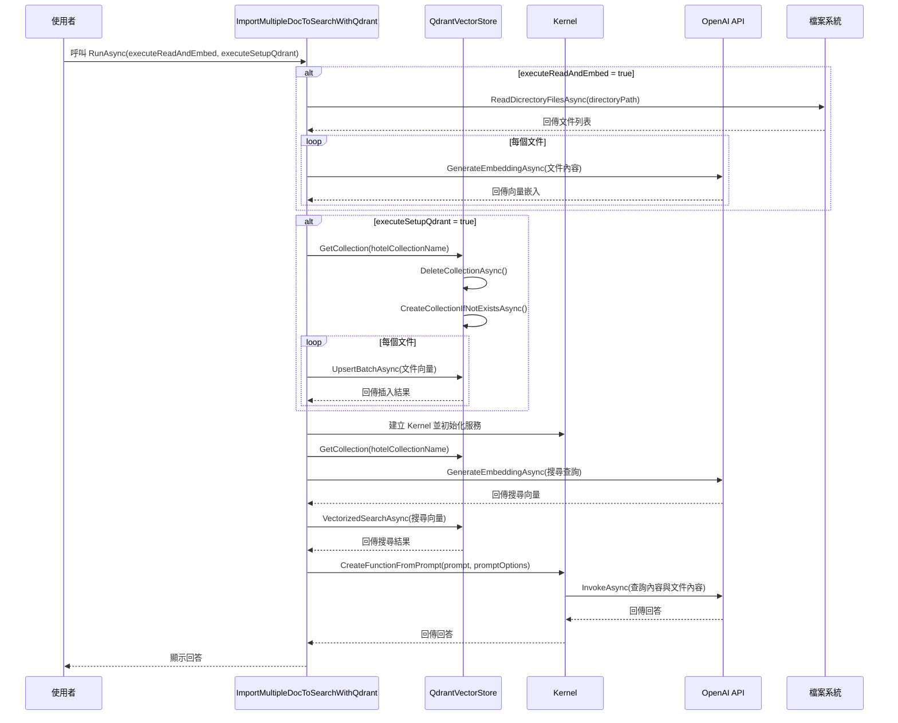

# qdrant QA問答初版

```mermaid
sequenceDiagram 
    participant User as 使用者 
    participant Importer as ImportMultipleDocToSearchWithQdrant 
    participant Qdrant as QdrantVectorStore 
    participant Kernel as Kernel 
    participant OpenAI as OpenAI API 
    participant FileSystem as 檔案系統

    User->>Importer: 呼叫 RunAsync(executeReadAndEmbed, executeSetupQdrant)
    alt executeReadAndEmbed = true
        Importer->>FileSystem: ReadDicrectoryFilesAsync(directoryPath)
        FileSystem-->>Importer: 回傳文件列表
        loop 每個文件
            Importer->>OpenAI: GenerateEmbeddingAsync(文件內容)
            OpenAI-->>Importer: 回傳向量嵌入
        end
    end

    alt executeSetupQdrant = true
        Importer->>Qdrant: GetCollection(hotelCollectionName)
        Qdrant->>Qdrant: DeleteCollectionAsync()
        Qdrant->>Qdrant: CreateCollectionIfNotExistsAsync()
        loop 每個文件
            Importer->>Qdrant: UpsertBatchAsync(文件向量)
            Qdrant-->>Importer: 回傳插入結果
        end
    end

    Importer->>Kernel: 建立 Kernel 並初始化服務
    Importer->>Qdrant: GetCollection(hotelCollectionName)
    Importer->>OpenAI: GenerateEmbeddingAsync(搜尋查詢)
    OpenAI-->>Importer: 回傳搜尋向量
    Importer->>Qdrant: VectorizedSearchAsync(搜尋向量)
    Qdrant-->>Importer: 回傳搜尋結果

    Importer->>Kernel: CreateFunctionFromPrompt(prompt, promptOptions)
    Kernel->>OpenAI: InvokeAsync(查詢內容與文件內容)
    OpenAI-->>Kernel: 回傳回答
    Kernel-->>Importer: 回傳回答
    Importer-->>User: 顯示回答

```